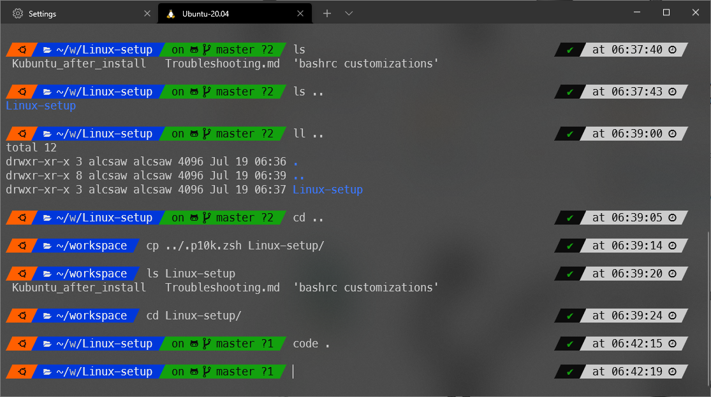

# Zsh P10K
This configuration files are used to setup Z Shell with Power Level 10000 theme.



---

Resources used:

https://github.com/zsh-users/zsh

https://github.com/romkatv/powerlevel10k

https://github.com/zsh-users/zsh-autosuggestions


## Setup steps

On Windows 10 (WSL2):

1. Install Windows Terminal
2. [Install p10k recommended font](https://github.com/romkatv/powerlevel10k#meslo-nerd-font-patched-for-powerlevel10k)
3. Setup the newly installed font in Terminal Settings ([settings.json available in this repo dir](./windowsTerminalSettings.json)) - see the note below for more information
4. [Setup WSL2](https://docs.microsoft.com/en-us/windows/wsl/install-win10)
5. Install Ubuntu from MS Store

On Linux (Ubuntu 22.04):

6. Install Zsh (`sudo apt install zsh`)
7. Install [zsh-autosuggestions](https://github.com/zsh-users/zsh-autosuggestions) ([Manual installation](https://github.com/zsh-users/zsh-autosuggestions/blob/master/INSTALL.md#manual-git-clone))
8. (Recomended, but optional) initialize Zsh by executing `zsh` and following the configuration wizard; then `exit`
9. Copy the contents of [zshrc](./zshrc) to your `~/.zshrc`
10. [Install p10k](https://github.com/romkatv/powerlevel10k#manual)
11. (Recomended, but optional) initialize P10K theme by executing `zsh` again and following the configuration wizard; then `exit`
12. Copy the contents of [p10k.zsh](./p10k.zsh) to your `~/.p10k.zsh`; or make a diff from yours and add settings accordingly.

## Notes

**Note about the configuration files:**

I left in this repo the original configuration file created by Zsh ([~/.zshrc](./original_zshrc)) and P10K ([~/.p10k.zsh](./original_p10k.zsh)) for reference. Since the configuration template changes over time, having the original version as of my installation, you can compare them and check what exactly I've changed to replicate my environment.

**Note about the terminal font:**

If you already have a WSL distro installed (e.g. Ubuntu), you can update the font only for that distro as shown below. In the settings.json you'll find a key `profiles -> list` which lists all environments you have enabled. Locate the one you want to install _zsh_ and (by default) it should look like that:

```json
{
    "guid": "{17bf3de4-5353-5709-bcf9-835bd952a95e}",
    "hidden": true,
    "name": "Ubuntu-22.04",
    "source": "Windows.Terminal.Wsl"
},
```


Update the item adding your prefered settings, like this (remember your guid should not be changed):
```json
{
    "guid": "{17bf3de4-5353-5709-bcf9-835bd952a95e}",
    "hidden": true,
    "name": "Ubuntu-22.04",
    "source": "Windows.Terminal.Wsl",
    "font": {
        "face": "MesloLGS NF"
    },
    "opacity": 90,
    "startingDirectory": "/mnt/c/Users/Alcsaw/workspace",
    "useAcrylic": true
},
```
