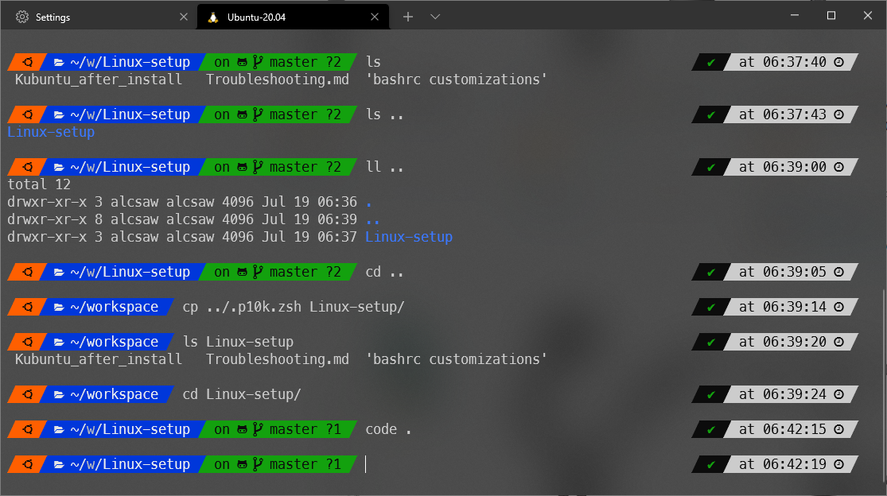

# Zsh P10K
This configuration files are used to setup Z Shell with Power Level 10000 theme.

---

Check out the [zsh/zshPowerLevel10k.md](zsh/zshPowerLevel10k.md) for instructions on how to setup the zsh with some nice features like:
- Powerlevel 10k theme with custom Ubuntu colors
- autosuggestions for a much better autocomplete experience
- <kbd>CTRL</kbd>+<kbd>&#8592;</kbd> and <kbd>CTRL</kbd>+<kbd>&#8594;</kbd> to navigate words
- <kbd>CTRL</kbd>+<kbd>Delete</kbd> to delete next word
- <kbd>CTRL</kbd>+<kbd>Backspace</kbd> to delete previous word
- appendable command history file with timestamps
- basic aliases
